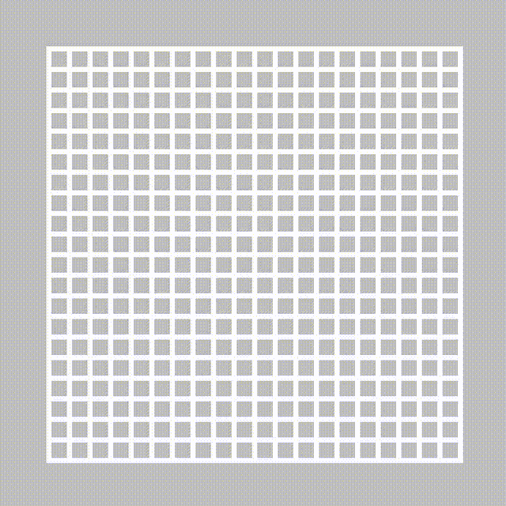
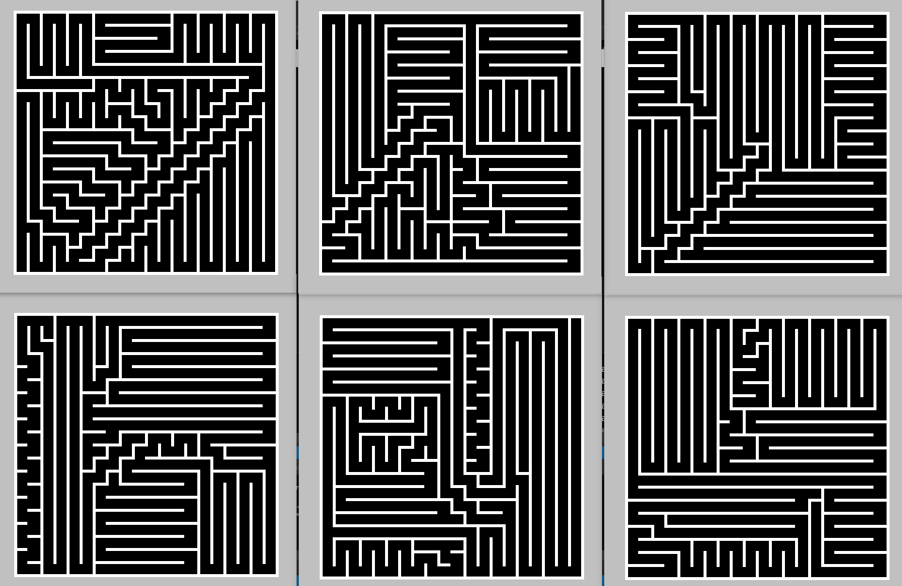
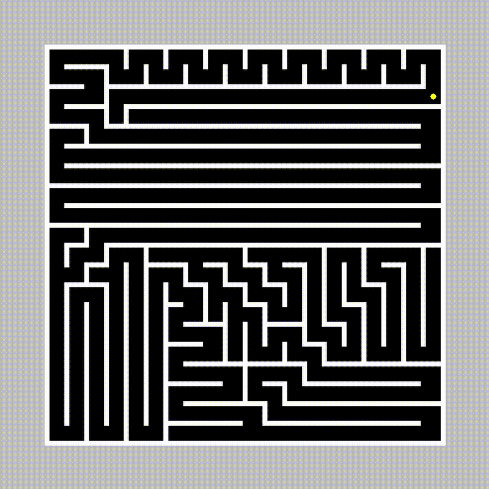

# maze-generator-solver
A C++ script that generates random mazes using recursive backtracking algorithm and solves it using left-hand rule algorithm.

## Features
* Generate random mazes with different sizes using recursive backtracking algorithm
* Solve mazes using left-hand rule algorithm
* Visualize the maze and the solving process using graphics.h lib

## Recursive backtracking algorithm

This algorithm solves problems by trying all possible solutions and discarding the ones that don't work. It can be used to solve a variety of problems, including maze solving, Sudoku solving, and finding the shortest path between two points.

For more information on how the recursive backtracking algorithm works, please refer to [Maze Generation Algorithms (Part 1)](https://rstudio-pubs-static.s3.amazonaws.com/707197_9126acd72ef94d0591a93f9350d08537.html).

The maze generation algorithm works by randomly creating walls and then removing some of the walls to create a path from the entrance to the exit. The GIF below shows how the algorithm works in action.

    

This image shows a variety of randomly generated mazes

## Left-hand rule algorithm
The left-hand rule algorithm is a simple and effective algorithm for solving line-following mazes. The algorithm works by always following the line to the left until you reach the exit of the maze. If you cannot follow the line to the left, then go straight. If you cannot go straight, then turn right.

The left-hand rule algorithm is guaranteed to find the exit of a line-following maze, but it may not be the shortest or the fastest path.

    

<pre style="background-color: gray;">

    Optimized path : FFFFFLFFFLFFLFFF

</pre>
The robot's final path is displayed as a sequence of directional decisions made at each node, where a node is defined as an intersection of multiple paths or a point where the robot has multiple possible directions to choose from.
